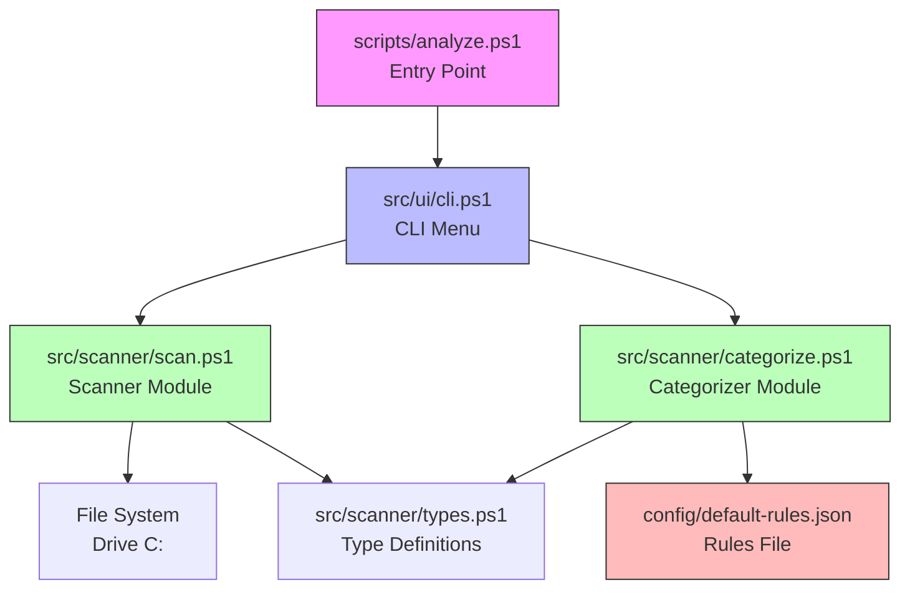
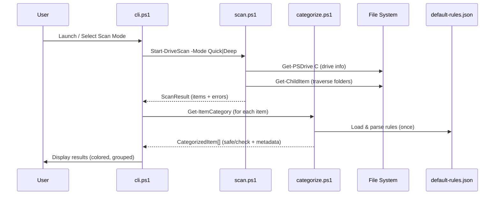
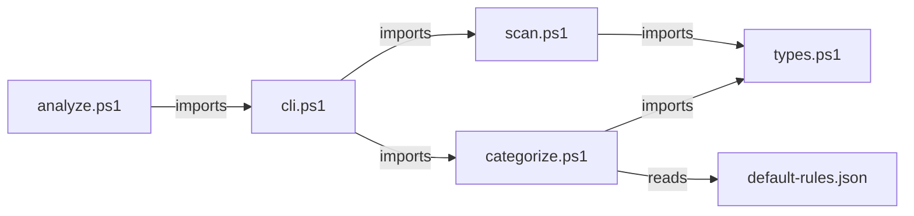
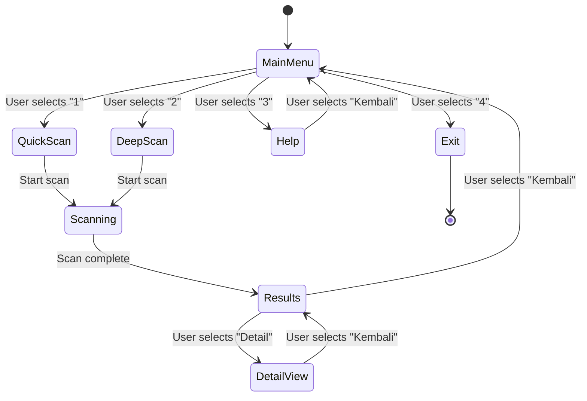
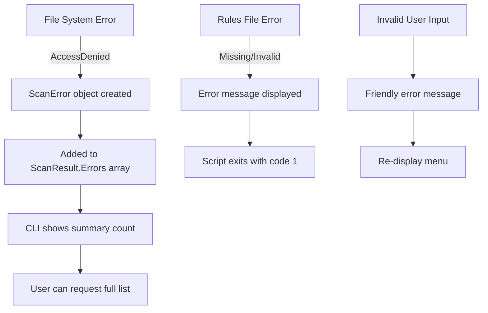

# Design Document: Core Scanner

## Overview

The Core Scanner feature refactors DrivePulse's monolithic `scripts/analyze.ps1` into a modular architecture with three primary modules: Scanner (`src/scanner/scan.ps1`), Categorizer (`src/scanner/categorize.ps1`), and CLI Menu (`src/ui/cli.ps1`). The system scans drive C: in two modes (Quick and Deep), categorizes findings using rules from `config/default-rules.json`, and presents results through an interactive Bahasa Indonesia CLI with color-coded output.

**Key Design Decisions:**
- PowerShell 5.1+ only — no external dependencies, leveraging built-in cmdlets (`Get-ChildItem`, `Get-PSDrive`, `Measure-Object`)
- Structured data flow using `[PSCustomObject]` arrays between modules
- Rules-driven categorization loaded from JSON at startup
- Dry-run as the only mode in v1.1 (no destructive operations)
- Graceful degradation when running without administrator privileges

## Architecture

### High-Level System Diagram



### Data Flow Diagram



### Module Dependency Graph



## Components and Interfaces

### Module: `src/scanner/types.ps1` — Type Definitions

Defines shared data structures used across all modules.

```powershell
# ─── Enumerations ───────────────────────────────────────────

enum ScanMode {
    Quick
    Deep
}

enum ItemCategory {
    Safe
    Check
    Unknown
}

# ─── Data Structures (PSCustomObject factories) ─────────────

function New-ScanItem {
    <#
    .SYNOPSIS Creates a scan result item
    .PARAMETER Path     Resolved file system path
    .PARAMETER Label    Human-readable label (Bahasa Indonesia)
    .PARAMETER SizeBytes Total size in bytes
    .PARAMETER IsAccessible Whether the path was readable
    #>
    param(
        [string]$Path,
        [string]$Label,
        [long]$SizeBytes,
        [bool]$IsAccessible = $true
    )
    [PSCustomObject]@{
        PSTypeName   = 'DrivePulse.ScanItem'
        Path         = $Path
        Label        = $Label
        SizeBytes    = $SizeBytes
        IsAccessible = $IsAccessible
    }
}

function New-CategorizedItem {
    <#
    .SYNOPSIS Creates a categorized result item
    .PARAMETER ScanItem      The original scan item
    .PARAMETER Category      Safe | Check | Unknown
    .PARAMETER SideEffect    Side effect description (safe items)
    .PARAMETER Reason        Reason for manual check (check items)
    .PARAMETER Recommendation Recommendation text (check items)
    .PARAMETER RequiresAdmin Whether admin rights needed
    #>
    param(
        [PSCustomObject]$ScanItem,
        [ItemCategory]$Category,
        [string]$SideEffect = "",
        [string]$Reason = "",
        [string]$Recommendation = "",
        [bool]$RequiresAdmin = $false
    )
    [PSCustomObject]@{
        PSTypeName     = 'DrivePulse.CategorizedItem'
        Path           = $ScanItem.Path
        Label          = $ScanItem.Label
        SizeBytes      = $ScanItem.SizeBytes
        Category       = $Category
        SideEffect     = $SideEffect
        Reason         = $Reason
        Recommendation = $Recommendation
        RequiresAdmin  = $RequiresAdmin
    }
}

function New-ScanResult {
    <#
    .SYNOPSIS Creates the top-level scan result container
    #>
    param(
        [ScanMode]$Mode,
        [string]$DriveLetter,
        [long]$UsedBytes,
        [long]$FreeBytes,
        [PSCustomObject[]]$Items,
        [PSCustomObject[]]$Errors,
        [double]$ElapsedSeconds
    )
    [PSCustomObject]@{
        PSTypeName     = 'DrivePulse.ScanResult'
        Mode           = $Mode
        DriveLetter    = $DriveLetter
        UsedBytes      = $UsedBytes
        FreeBytes      = $FreeBytes
        TotalBytes     = $UsedBytes + $FreeBytes
        UsagePercent   = [math]::Round(($UsedBytes / ($UsedBytes + $FreeBytes)) * 100, 1)
        Items          = $Items
        Errors         = $Errors
        ElapsedSeconds = $ElapsedSeconds
        Timestamp      = Get-Date -Format 'yyyy-MM-dd HH:mm:ss'
    }
}

function New-ScanError {
    <#
    .SYNOPSIS Creates an error record for skipped folders
    #>
    param(
        [string]$Path,
        [string]$Message
    )
    [PSCustomObject]@{
        PSTypeName = 'DrivePulse.ScanError'
        Path       = $Path
        Message    = $Message
        Timestamp  = Get-Date -Format 'yyyy-MM-dd HH:mm:ss'
    }
}
```

### Module: `src/scanner/scan.ps1` — Scanner

```powershell
<#
.SYNOPSIS Main scanner module
.DESCRIPTION Exports Start-DriveScan function for Quick and Deep scan modes
#>

# Import types
. "$PSScriptRoot\types.ps1"

function Start-DriveScan {
    <#
    .SYNOPSIS Scans drive C: in Quick or Deep mode
    .PARAMETER Mode   Quick (top-level + known junk) or Deep (recursive)
    .PARAMETER DriveLetter Target drive letter (default "C")
    .PARAMETER RulesFile Path to rules JSON (for known locations in Quick mode)
    .OUTPUTS DrivePulse.ScanResult
    #>
    param(
        [ValidateSet("Quick", "Deep")]
        [string]$Mode = "Quick",
        [string]$DriveLetter = "C",
        [string]$RulesFile = "$PSScriptRoot\..\..\config\default-rules.json"
    )
    # Returns: [PSCustomObject] DrivePulse.ScanResult
}

function Get-FolderSize {
    <#
    .SYNOPSIS Calculates total size of a folder (recursive)
    .PARAMETER Path Folder path to measure
    .OUTPUTS [long] Total size in bytes, or -1 if inaccessible
    #>
    param([string]$Path)
    # Internal helper — not exported
}

function Resolve-RulePath {
    <#
    .SYNOPSIS Resolves environment variables in a path string
    .PARAMETER RawPath Path with %VAR% placeholders
    .OUTPUTS [string] Resolved absolute path
    #>
    param([string]$RawPath)
    # Handles: %TEMP%, %LOCALAPPDATA%, %APPDATA%, %USERPROFILE%
}
```

**Algorithm: Quick Scan**
```
1. Load rules file → extract all paths from categories.safe.items + categories.check.items
2. Resolve environment variables in each path
3. For each resolved path:
   a. If path exists → measure folder size (Get-FolderSize)
   b. If AccessDenied → record error, mark item as inaccessible
   c. Create ScanItem with path, label, size
4. Get drive info (Get-PSDrive) → used/free bytes
5. Return ScanResult with all items, errors, elapsed time
```

**Algorithm: Deep Scan**
```
1. Get drive info (Get-PSDrive) → used/free bytes
2. Load rules file → extract largeFolderGB threshold
3. Get top-level directories of drive root
4. For each top-level directory:
   a. Recursively enumerate subfolders (Get-ChildItem -Directory -Recurse)
   b. For each folder, calculate size
   c. If size >= threshold → add to results as ScanItem
   d. If AccessDenied → record error, continue
   e. Update progress callback with current path + percentage
5. Return ScanResult with all items exceeding threshold, errors, elapsed time
```

### Module: `src/scanner/categorize.ps1` — Categorizer

```powershell
<#
.SYNOPSIS Categorization module
.DESCRIPTION Classifies scan items as Safe/Check based on rules file
#>

# Import types
. "$PSScriptRoot\types.ps1"

function Initialize-Rules {
    <#
    .SYNOPSIS Loads and validates the rules file
    .PARAMETER RulesFile Path to default-rules.json
    .OUTPUTS [PSCustomObject] Parsed rules object
    .THROWS Terminates with error message if file missing or invalid JSON
    #>
    param([string]$RulesFile)
}

function Get-ItemCategory {
    <#
    .SYNOPSIS Categorizes a single scan item against loaded rules
    .PARAMETER ScanItem A DrivePulse.ScanItem object
    .PARAMETER Rules Parsed rules object from Initialize-Rules
    .PARAMETER IsAdmin Whether script is running elevated
    .OUTPUTS DrivePulse.CategorizedItem
    #>
    param(
        [PSCustomObject]$ScanItem,
        [PSCustomObject]$Rules,
        [bool]$IsAdmin = $false
    )
}

function Get-AllCategories {
    <#
    .SYNOPSIS Categorizes all items in a scan result
    .PARAMETER ScanResult A DrivePulse.ScanResult object
    .PARAMETER Rules Parsed rules object
    .PARAMETER IsAdmin Whether script is running elevated
    .OUTPUTS DrivePulse.CategorizedItem[]
    #>
    param(
        [PSCustomObject]$ScanResult,
        [PSCustomObject]$Rules,
        [bool]$IsAdmin = $false
    )
}
```

**Algorithm: Categorization**
```
1. For each ScanItem in results:
   a. Normalize path (resolve env vars, lowercase for comparison)
   b. Search rules.categories.safe.items for path match
   c. If match found → return CategorizedItem(Safe, sideEffect from rule)
   d. Search rules.categories.check.items for path match
   e. If match found → return CategorizedItem(Check, reason + recommendation from rule)
   f. If no match AND size >= largeFolderGB threshold:
      → return CategorizedItem(Check, reason="Folder besar tanpa aturan spesifik")
   g. If no match AND size < threshold → return CategorizedItem(Unknown)
2. If rule has requiresAdmin=true AND !IsAdmin:
   → annotate item with admin note
```

### Module: `src/ui/cli.ps1` — Interactive CLI

```powershell
<#
.SYNOPSIS Interactive CLI menu in Bahasa Indonesia
.DESCRIPTION Handles user interaction, progress display, and results formatting
#>

# Import modules
. "$PSScriptRoot\..\scanner\scan.ps1"
. "$PSScriptRoot\..\scanner\categorize.ps1"

function Show-MainMenu {
    <#
    .SYNOPSIS Displays the main menu and handles user selection
    .OUTPUTS [string] User's menu choice
    #>
}

function Show-Progress {
    <#
    .SYNOPSIS Displays scan progress (current folder + percentage)
    .PARAMETER CurrentPath Folder currently being scanned
    .PARAMETER PercentComplete Estimated completion (0-100)
    .PARAMETER Mode Quick or Deep (affects display style)
    #>
    param(
        [string]$CurrentPath,
        [int]$PercentComplete,
        [ScanMode]$Mode
    )
}

function Show-ScanResults {
    <#
    .SYNOPSIS Displays categorized scan results with colors
    .PARAMETER ScanResult The DrivePulse.ScanResult object
    .PARAMETER CategorizedItems Array of DrivePulse.CategorizedItem
    #>
    param(
        [PSCustomObject]$ScanResult,
        [PSCustomObject[]]$CategorizedItems
    )
}

function Show-DriveStatus {
    <#
    .SYNOPSIS Displays drive usage bar and statistics
    .PARAMETER ScanResult The DrivePulse.ScanResult object
    #>
    param([PSCustomObject]$ScanResult)
}

function Format-Size {
    <#
    .SYNOPSIS Formats bytes to human-readable GB or MB
    .PARAMETER Bytes Size in bytes
    .OUTPUTS [string] Formatted size string (e.g., "2.5 GB" or "350 MB")
    #>
    param([long]$Bytes)
}

function Show-ErrorSummary {
    <#
    .SYNOPSIS Shows count of skipped folders, offers to show full list
    .PARAMETER Errors Array of DrivePulse.ScanError objects
    #>
    param([PSCustomObject[]]$Errors)
}
```

### Entry Point: `scripts/analyze.ps1` (Refactored)

```powershell
<#
.SYNOPSIS DrivePulse entry point — imports modules and launches CLI
#>

# Import CLI module (which imports scanner + categorizer)
. "$PSScriptRoot\..\src\ui\cli.ps1"

# Check admin status
$Script:IsAdmin = ([Security.Principal.WindowsPrincipal] `
    [Security.Principal.WindowsIdentity]::GetCurrent()).IsInRole(
    [Security.Principal.WindowsBuiltInRole]::Administrator)

# Show admin info message (one-time, per Requirement 6.4)
if (-not $Script:IsAdmin) {
    Show-AdminInfoMessage
}

# Launch interactive menu
Show-MainMenu
```

## Data Models

### Rules File Schema (`config/default-rules.json`)

```json
{
  "_schema": "string — schema identifier",
  "version": "string — semver",
  "thresholds": {
    "largeFolderGB": "number — size threshold for flagging large folders",
    "criticalUsagePct": "number — percentage for red warning",
    "warningUsagePct": "number — percentage for yellow warning"
  },
  "categories": {
    "safe": {
      "description": "string",
      "items": [
        {
          "id": "string — unique identifier",
          "label": "string — display name (Bahasa Indonesia)",
          "path": "string — path with %ENV_VAR% placeholders",
          "pattern": "string? — optional glob pattern",
          "requiresAdmin": "boolean? — default false",
          "sideEffect": "string — side effect description"
        }
      ]
    },
    "check": {
      "description": "string",
      "items": [
        {
          "id": "string — unique identifier",
          "label": "string — display name",
          "path": "string — path or '*' for wildcard",
          "reason": "string — why manual check needed",
          "recommendation": "string — what user should do"
        }
      ]
    }
  },
  "whitelist": "string[] — paths to never touch",
  "blacklist": "string[] — paths to always flag"
}
```

### Internal Data Flow Objects

| Object | Source | Destination | Fields |
|--------|--------|-------------|--------|
| `DrivePulse.ScanItem` | scan.ps1 | categorize.ps1, cli.ps1 | Path, Label, SizeBytes, IsAccessible |
| `DrivePulse.CategorizedItem` | categorize.ps1 | cli.ps1 | Path, Label, SizeBytes, Category, SideEffect, Reason, Recommendation, RequiresAdmin |
| `DrivePulse.ScanResult` | scan.ps1 | cli.ps1 | Mode, DriveLetter, UsedBytes, FreeBytes, TotalBytes, UsagePercent, Items[], Errors[], ElapsedSeconds, Timestamp |
| `DrivePulse.ScanError` | scan.ps1 | cli.ps1 | Path, Message, Timestamp |

### State Machine: CLI Menu Navigation



## Correctness Properties

*A property is a characteristic or behavior that should hold true across all valid executions of a system — essentially, a formal statement about what the system should do. Properties serve as the bridge between human-readable specifications and machine-verifiable correctness guarantees.*

### Property 1: Environment Variable Path Resolution

*For any* path string containing one or more known environment variable placeholders (%TEMP%, %LOCALAPPDATA%, %APPDATA%, %USERPROFILE%), `Resolve-RulePath` SHALL return a string that contains no `%` characters and begins with a valid drive letter followed by `:\`.

**Validates: Requirements 1.4**

### Property 2: Scan Result Structure Completeness

*For any* folder that exists and is accessible, when scanned by `Start-DriveScan`, the resulting `ScanItem` SHALL have a non-empty Path, a non-empty Label, and a SizeBytes value greater than or equal to zero.

**Validates: Requirements 1.3**

### Property 3: Deep Scan Threshold Filtering

*For any* set of folders with varying sizes and any positive `largeFolderGB` threshold value, `Start-DriveScan` in Deep mode SHALL return only items whose SizeBytes is greater than or equal to `largeFolderGB * 1GB`. No item below the threshold SHALL appear in the results.

**Validates: Requirements 2.3**

### Property 4: Categorization Produces Valid Output with Correct Metadata

*For any* valid `ScanItem` and any valid parsed rules object, `Get-ItemCategory` SHALL return a `CategorizedItem` where:
- The Category is one of Safe, Check, or Unknown
- If Category is Safe, the SideEffect field equals the sideEffect from the matching rule
- If Category is Check and a rule matched, the Reason and Recommendation fields equal those from the matching rule
- If Category is Check and no rule matched (large unmatched folder), the Reason equals "Folder besar tanpa aturan spesifik"
- If the matching rule has `requiresAdmin=true` and `IsAdmin=false`, the RequiresAdmin field is true

**Validates: Requirements 3.1, 3.2, 3.3, 3.4, 3.5**

### Property 5: Access Denied Recovery

*For any* list of folder paths where some are accessible and some throw Access Denied errors, `Start-DriveScan` SHALL return `ScanItem` results for all accessible folders. The count of returned items plus the count of errors SHALL equal the total number of paths attempted.

**Validates: Requirements 6.1**

### Property 6: Access Denied Error Logging

*For any* folder that throws an Access Denied error during scanning, the resulting `ScanResult.Errors` collection SHALL contain a `ScanError` entry with the exact path of the inaccessible folder and a non-empty error message.

**Validates: Requirements 6.2**

### Property 7: Size Formatting Correctness

*For any* byte value >= 0, `Format-Size` SHALL return a string ending in " GB" when the value is >= 1,073,741,824 (1 GB), and a string ending in " MB" when the value is < 1,073,741,824. The numeric portion SHALL be a valid positive number (or zero for 0 bytes).

**Validates: Requirements 8.2**

### Property 8: Display Output Contains Required Fields Per Category

*For any* `CategorizedItem`, the formatted display string SHALL contain:
- The item's Label and formatted size (always)
- The SideEffect text (when Category is Safe)
- The Reason and Recommendation text (when Category is Check)

**Validates: Requirements 8.4, 8.5**

### Property 9: Summary Totals Invariant

*For any* array of `CategorizedItem` objects, the displayed "total reclaimable space" SHALL equal the sum of SizeBytes for all items with Category=Safe, and the displayed "total space requiring review" SHALL equal the sum of SizeBytes for all items with Category=Check.

**Validates: Requirements 8.6**

### Property 10: Invalid JSON Graceful Handling

*For any* string that is not valid JSON (random bytes, truncated JSON, malformed structures), `Initialize-Rules` SHALL not throw an unhandled exception and SHALL produce a descriptive error message containing the word "error" or "gagal".

**Validates: Requirements 10.2**

### Property 11: Rules File Round-Trip Parsing

*For any* valid rules file JSON structure conforming to the schema (containing thresholds, categories with safe/check items), parsing with `Initialize-Rules` and then serializing the result back to JSON with `ConvertTo-Json` SHALL produce a structure that is semantically equivalent to the original (same keys, same values, same nesting).

**Validates: Requirements 10.4**

## Error Handling

### Error Categories and Strategies

| Error Type | Source | Handling Strategy | User Message |
|-----------|--------|-------------------|--------------|
| Access Denied | File system (Get-ChildItem) | Skip folder, log to Errors[], continue | "X folder dilewati karena akses ditolak" |
| Rules File Missing | Initialize-Rules | Display error, terminate gracefully | "File aturan tidak ditemukan: config/default-rules.json" |
| Invalid JSON | Initialize-Rules (ConvertFrom-Json) | Display error with details, terminate | "File aturan rusak (JSON tidak valid). Periksa format file." |
| Drive Not Found | Get-PSDrive | Display error, terminate | "Drive C: tidak ditemukan atau tidak tersedia" |
| Invalid Menu Input | Read-Host | Show friendly message, re-prompt | "Pilihan tidak valid. Silakan pilih 1-4." |
| Scan Timeout | Deep Scan exceeding limit | Return partial results with warning | "Scan memakan waktu lebih lama dari biasanya..." |

### Error Propagation Flow



### Defensive Coding Patterns

```powershell
# Pattern 1: Access Denied handling in scan loop
try {
    $size = (Get-ChildItem $path -Recurse -Force -ErrorAction Stop |
             Measure-Object -Property Length -Sum).Sum
} catch [System.UnauthorizedAccessException] {
    $errors += New-ScanError -Path $path -Message $_.Exception.Message
    continue
} catch {
    $errors += New-ScanError -Path $path -Message "Error tidak dikenal: $($_.Exception.Message)"
    continue
}

# Pattern 2: Rules file validation
function Initialize-Rules {
    param([string]$RulesFile)
    
    if (-not (Test-Path $RulesFile)) {
        Write-Host "❌ File aturan tidak ditemukan: $RulesFile" -ForegroundColor Red
        exit 1
    }
    
    try {
        $content = Get-Content $RulesFile -Raw -Encoding UTF8
        $rules = $content | ConvertFrom-Json
    } catch {
        Write-Host "❌ File aturan rusak (JSON tidak valid)." -ForegroundColor Red
        Write-Host "   Detail: $($_.Exception.Message)" -ForegroundColor Gray
        exit 1
    }
    
    # Validate required structure
    if (-not $rules.thresholds -or -not $rules.categories) {
        Write-Host "❌ Struktur file aturan tidak lengkap." -ForegroundColor Red
        exit 1
    }
    
    return $rules
}
```

## Testing Strategy

### Testing Framework

- **Pester 5.x** — the standard PowerShell testing framework
- Install: `Install-Module Pester -Force -SkipPublisherCheck`
- Tests located in `tests/` directory

### Test Structure

```
tests/
├── unit/
│   ├── scan.Tests.ps1           # Scanner unit tests
│   ├── categorize.Tests.ps1     # Categorizer unit tests
│   ├── types.Tests.ps1          # Type factory tests
│   ├── format.Tests.ps1         # Format-Size and display tests
│   └── resolve-path.Tests.ps1   # Path resolution tests
├── property/
│   ├── scan.Property.Tests.ps1       # Scanner property tests
│   ├── categorize.Property.Tests.ps1 # Categorizer property tests
│   ├── format.Property.Tests.ps1     # Formatting property tests
│   └── rules.Property.Tests.ps1      # Rules parsing property tests
├── integration/
│   ├── full-scan.Tests.ps1      # End-to-end scan tests
│   └── cli-menu.Tests.ps1       # CLI interaction tests
└── helpers/
    └── generators.ps1           # Random data generators for PBT
```

### Property-Based Testing Approach

**Library:** Custom PBT harness using Pester + PowerShell random generators (PowerShell lacks a mature PBT library like QuickCheck, so we implement a lightweight generator-based approach).

**Configuration:**
- Minimum 100 iterations per property test
- Each test tagged with property reference comment

**Generator Examples:**

```powershell
# generators.ps1 — Random data generators

function New-RandomPath {
    # Generates random paths with env var placeholders
    $envVars = @('%TEMP%', '%LOCALAPPDATA%', '%APPDATA%', '%USERPROFILE%')
    $segments = @('folder1', 'sub folder', 'cache', 'data', 'temp')
    $envVar = $envVars | Get-Random
    $depth = Get-Random -Minimum 1 -Maximum 4
    $subPath = ($segments | Get-Random -Count $depth) -join '\'
    return "$envVar\$subPath"
}

function New-RandomScanItem {
    # Generates random ScanItem objects
    param([long]$MinSize = 0, [long]$MaxSize = 500GB)
    $size = Get-Random -Minimum $MinSize -Maximum $MaxSize
    $label = "Test Item $(Get-Random)"
    $path = "C:\$(New-Guid)"
    return New-ScanItem -Path $path -Label $label -SizeBytes $size
}

function New-RandomRulesJson {
    # Generates random valid rules file structures
    $threshold = Get-Random -Minimum 1 -Maximum 20
    $safeCount = Get-Random -Minimum 1 -Maximum 5
    $checkCount = Get-Random -Minimum 1 -Maximum 5
    # ... builds valid JSON structure
}

function New-RandomInvalidJson {
    # Generates random invalid JSON strings
    $strategies = @(
        { "not json at all $(Get-Random)" },
        { "{incomplete: $(Get-Random)" },
        { '{"valid": "json", "but": }' },
        { [System.Text.Encoding]::UTF8.GetString((1..50 | ForEach-Object { Get-Random -Max 256 })) }
    )
    return (& ($strategies | Get-Random))
}
```

**Property Test Example:**

```powershell
# Feature: core-scanner, Property 7: Size Formatting Correctness
Describe "Format-Size Property Tests" {
    It "For any byte value, formats as GB when >= 1GB and MB when < 1GB" {
        1..100 | ForEach-Object {
            $bytes = Get-Random -Minimum 0 -Maximum ([long]500GB)
            $result = Format-Size -Bytes $bytes
            
            if ($bytes -ge 1GB) {
                $result | Should -Match '\d+(\.\d+)?\s*GB$'
            } else {
                $result | Should -Match '\d+(\.\d+)?\s*MB$'
            }
        }
    }
}
```

### Unit Test Coverage

| Module | Key Test Cases |
|--------|---------------|
| types.ps1 | Factory functions return correct PSTypeName; required fields non-null |
| scan.ps1 | Quick scan visits all rules paths; Deep scan respects threshold; Drive info populated |
| categorize.ps1 | Known safe paths → Safe; Known check paths → Check; Unknown paths handled; Admin annotation |
| cli.ps1 | Menu displays all options; Colors match categories; Invalid input re-prompts |

### Integration Tests

- Full Quick Scan on a mock directory structure (using `TestDrive:` in Pester)
- Full Deep Scan with threshold filtering
- CLI menu flow simulation (mocked Read-Host)
- Rules file loading from actual `config/default-rules.json`

### Performance Tests

- Quick Scan completes within 15 seconds on 500GB drive
- Deep Scan completes within 60 seconds on 500GB drive
- Measured using `Measure-Command` in dedicated performance test script

