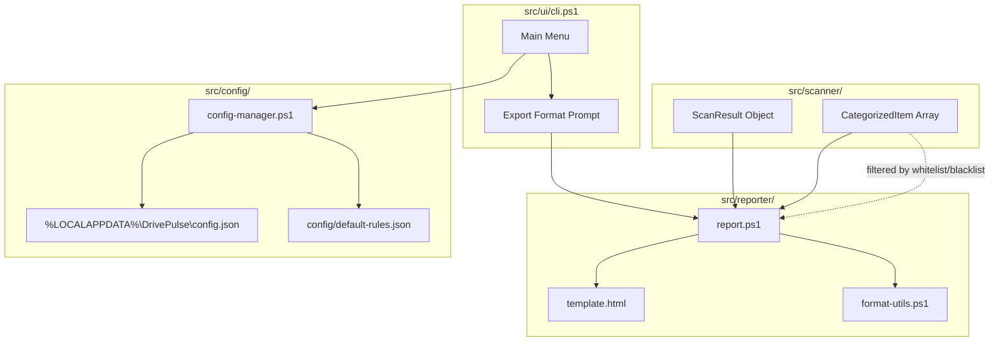

# Design Document: Report & Config

## Overview

This design covers the Report & Config feature (v1.2) for DrivePulse, adding two major capabilities:

1. **Report Generation** — Produce HTML and TXT reports from scan results, with color-coded drive status, categorized item tables, and recommendations in Bahasa Indonesia.
2. **User Configuration Management** — Persist user preferences (whitelist, blacklist, large folder threshold) in a local JSON config file at `%LOCALAPPDATA%\DrivePulse\config.json`.

The design builds on the existing `src/reporter/report.ps1` skeleton and `src/reporter/template.html`, extending the CLI menu to support report export and config-aware categorization.

### Key Design Decisions

- **Template engine approach**: Simple string replacement (`{{VAR}}` placeholders) in the existing HTML template — no external templating library needed since PowerShell's `-replace` operator handles this cleanly.
- **Self-contained HTML**: All CSS embedded in `<style>` tags, no external resources. This ensures offline viewing in any browser.
- **Config location**: `%LOCALAPPDATA%\DrivePulse\config.json` — standard Windows per-user app data location, no admin rights needed.
- **Whitelist priority over blacklist**: When a path appears in both lists, whitelist wins. This follows the principle of least surprise for protective rules.
- **Format-Size reuse**: The existing `Format-Size` function in `cli.ps1` is extracted to a shared utility so both CLI display and report generation use identical formatting logic.

## Architecture



### Data Flow

1. **Startup**: `Config_Manager` loads `config.json` (or creates defaults). Threshold value overrides `default-rules.json`.
2. **Scan**: Scanner produces `ScanResult` with `Items` array.
3. **Categorization**: `categorize.ps1` uses rules + config threshold to produce `CategorizedItem[]`.
4. **Filtering**: Before report generation, whitelist/blacklist rules are applied to the categorized items.
5. **Report Generation**: `New-DriveReport` takes filtered items + scan result, produces HTML or TXT file.
6. **CLI Integration**: Post-scan menu offers export option, invokes report generation, displays result path.

## Components and Interfaces

### 1. Report Generator (`src/reporter/report.ps1`)

```powershell
function New-DriveReport {
    param(
        [Parameter(Mandatory)]
        [PSCustomObject]$ScanResult,        # DrivePulse.ScanResult

        [Parameter(Mandatory)]
        [PSCustomObject[]]$CategorizedItems, # DrivePulse.CategorizedItem[]

        [ValidateSet("HTML", "TXT")]
        [string]$Format = "HTML",

        [string]$OutputPath = "$env:USERPROFILE\Desktop"
    )
    # Returns: [PSCustomObject]@{ Success = $true; FilePath = "..."; Error = $null }
    #      or: [PSCustomObject]@{ Success = $false; FilePath = $null; Error = "..." }
}
```

**Responsibilities:**
- Validate OutputPath exists and is writable
- Delegate to `New-HtmlReport` or `New-TxtReport` based on Format
- Return result object with success/failure info

```powershell
function New-HtmlReport {
    param(
        [PSCustomObject]$ScanResult,
        [PSCustomObject[]]$CategorizedItems,
        [string]$OutputPath
    )
    # Reads template.html, replaces placeholders, writes output file
}

function New-TxtReport {
    param(
        [PSCustomObject]$ScanResult,
        [PSCustomObject[]]$CategorizedItems,
        [string]$OutputPath
    )
    # Builds plain text report string, writes with UTF-8 BOM + CRLF
}
```

### 2. Format Utilities (`src/reporter/format-utils.ps1`)

```powershell
function Format-Size {
    param([long]$Bytes)
    # >= 1 GB: "X.X GB" (1 decimal)
    # < 1 GB: "X MB" (no decimal, rounded)
}

function Format-SizeDetailed {
    param([long]$Bytes)
    # For HTML report: KB/MB/GB with 2 decimal places
    # < 1 MB: "X.XX KB"
    # < 1 GB: "X.XX MB"
    # >= 1 GB: "X.XX GB"
}

function Format-Percent {
    param([double]$Value)
    # Returns "X.X%" format
}

function Get-ColorCode {
    param([double]$UsagePercent)
    # > 90: "#ff4757" (red)
    # 75-90: "#ffa502" (yellow)
    # < 75: "#2ed573" (green)
}
```

### 3. Config Manager (`src/config/config-manager.ps1`)

```powershell
function Get-UserConfig {
    # Reads %LOCALAPPDATA%\DrivePulse\config.json
    # Creates default if missing, warns on invalid JSON
    # Returns: [PSCustomObject]@{ Whitelist; Blacklist; LargeFolderGB }
}

function Save-UserConfig {
    param([PSCustomObject]$Config)
    # Validates constraints, writes UTF-8 JSON with 2-space indent
    # Returns: [PSCustomObject]@{ Success = $true/false; Error = $null/"..." }
}

function Test-ValidWindowsPath {
    param([string]$Path)
    # Returns $true if path starts with drive letter + :\
}

function Get-EffectiveThreshold {
    param(
        [PSCustomObject]$UserConfig,
        [PSCustomObject]$DefaultRules
    )
    # Returns largeFolderGB from user config if valid, else default
}
```

### 4. Whitelist/Blacklist Filter (`src/reporter/filter.ps1`)

```powershell
function Invoke-WhitelistFilter {
    param(
        [PSCustomObject[]]$CategorizedItems,
        [string[]]$Whitelist
    )
    # Removes items whose Path matches (case-insensitive, including subdirectories)
    # from the Safe category
}

function Invoke-BlacklistEnrich {
    param(
        [PSCustomObject[]]$CategorizedItems,
        [string[]]$Blacklist,
        [string[]]$Whitelist
    )
    # Adds existing blacklist folders as Safe items (whitelist takes priority)
}
```

### 5. CLI Integration (additions to `src/ui/cli.ps1`)

```powershell
function Show-ExportMenu {
    param(
        [PSCustomObject]$ScanResult,
        [PSCustomObject[]]$CategorizedItems
    )
    # Prompts format choice [1] HTML [2] TXT
    # Invokes New-DriveReport
    # Displays success/error message
    # Retries up to 3 times on invalid input
}
```

## Data Models

### User Config Schema (`config.json`)

```json
{
  "whitelist": ["C:\\Users\\Heri\\Documents", "D:\\Projects"],
  "blacklist": ["C:\\Users\\Heri\\OldStuff"],
  "largeFolderGB": 5
}
```

**Constraints:**
| Field | Type | Range | Default |
|-------|------|-------|---------|
| `whitelist` | string[] | 0-100 entries, each valid absolute Windows path | `[]` |
| `blacklist` | string[] | 0-50 entries, each ≤260 chars, valid absolute Windows path | `[]` |
| `largeFolderGB` | number | 0.1–100, up to 2 decimal places | `5` |

### Report Result Object

```powershell
[PSCustomObject]@{
    PSTypeName = 'DrivePulse.ReportResult'
    Success    = [bool]
    FilePath   = [string]  # Absolute path to generated file
    Format     = [string]  # "HTML" or "TXT"
    Error      = [string]  # null on success, error message on failure
}
```

### HTML Template Placeholders

| Placeholder | Source | Format |
|-------------|--------|--------|
| `{{DATE}}` | Current date | `yyyy-MM-dd` |
| `{{DRIVE}}` | `ScanResult.DriveLetter` | Single letter |
| `{{TOTAL_GB}}` | `ScanResult.TotalBytes / 1GB` | 2 decimal places |
| `{{USED_GB}}` | `ScanResult.UsedBytes / 1GB` | 2 decimal places |
| `{{USED_PCT}}` | `ScanResult.UsagePercent` | 1 decimal place |
| `{{VERSION}}` | DrivePulse version | e.g. "1.2" |
| `{{SAFE_ITEMS}}` | HTML table of Safe items | Label, Size, SideEffect |
| `{{CHECK_ITEMS}}` | HTML table of Check items | Label, Size, Reason, Recommendation |
| `{{RECOMMENDATIONS}}` | Unique recommendations list | Bahasa Indonesia |
| `{{PROGRESS_BAR}}` | CSS progress bar element | Width = UsagePercent% |
| `{{COLOR_CODE}}` | Color hex based on usage | `#ff4757`/`#ffa502`/`#2ed573` |

### TXT Report Structure

```
═══════════════════════════════════════════
  DrivePulse — Laporan Analisis Drive
  Tanggal: 2026-05-14 10:30:00
═══════════════════════════════════════════

📊 Status Drive
  Drive    : C:
  Total    : 325.0 GB
  Terpakai : 309.2 GB (95.1%)
  Tersedia : 15.8 GB

✅ Aman Dihapus
  ─────────────────────────────────────
  npm Cache                    2.5 GB
  Chrome Cache                 1.2 GB
  ...
  ─────────────────────────────────────
  Total bisa diklaim: 25.3 GB

❓ Perlu Dicek Manual
  ─────────────────────────────────────
  Downloads          8.5 GB   [Cek file terbesar, hapus installer lama]
  CapCut Cache       6.2 GB   [Cek apakah ada project aktif]
  ...
  ─────────────────────────────────────
  Total perlu review: 14.7 GB

💡 Ringkasan
  Bisa diklaim kembali : 25.3 GB
  Perlu review manual  : 14.7 GB

═══════════════════════════════════════════
  Generated by DrivePulse v1.2
═══════════════════════════════════════════
```

## Correctness Properties

*A property is a characteristic or behavior that should hold true across all valid executions of a system — essentially, a formal statement about what the system should do. Properties serve as the bridge between human-readable specifications and machine-verifiable correctness guarantees.*

### Property 1: Byte-to-GB Conversion Accuracy

*For any* ScanResult with TotalBytes and UsedBytes values between 0 and 2TB, the HTML report SHALL contain TOTAL_GB and USED_GB values that equal `Round(bytes / 1,073,741,824, 2)` — the bytes divided by 1 GB rounded to exactly 2 decimal places.

**Validates: Requirements 1.1**

### Property 2: Category Items Rendering Completeness

*For any* array of CategorizedItem objects, the generated report (HTML or TXT) SHALL contain every item from the input: all Safe items appear in the "Aman Dihapus" section with Label, formatted SizeBytes, and SideEffect; all Check items appear in the "Perlu Dicek Manual" section with Label, formatted SizeBytes, Reason, and Recommendation. No items are lost or duplicated.

**Validates: Requirements 1.2, 1.3, 3.3, 3.4**

### Property 3: Recommendations Deduplication

*For any* set of CategorizedItem objects with Category=Check, the recommendations section in the HTML report SHALL contain exactly one entry per unique Recommendation value — the count of rendered recommendations equals the count of distinct Recommendation strings from the Check items.

**Validates: Requirements 1.4**

### Property 4: Color Code Mapping

*For any* UsagePercent value between 0 and 100, the `Get-ColorCode` function SHALL return `#ff4757` (red) when UsagePercent > 90, `#ffa502` (yellow) when 75 ≤ UsagePercent ≤ 90, and `#2ed573` (green) when UsagePercent < 75. The mapping is total and deterministic.

**Validates: Requirements 2.2, 2.3, 2.4**

### Property 5: Self-Contained HTML

*For any* generated HTML report, the output SHALL contain zero `<link rel="stylesheet">` elements, zero `<script src="...">` elements, and zero `` elements — all styling is within a `<style>` tag and no external network requests are required.

**Validates: Requirements 1.6, 2.7**

### Property 6: TXT Report Items Sorted by Size Descending

*For any* array of CategorizedItem objects with 2 or more items in a category, the TXT report SHALL list items within each category section (Safe and Check) in strictly non-increasing order of SizeBytes.

**Validates: Requirements 3.3, 3.4**

### Property 7: Report Summary Totals Accuracy

*For any* array of CategorizedItem objects, the report summary total for Safe items SHALL equal the sum of SizeBytes of all items with Category=Safe, and the total for Check items SHALL equal the sum of SizeBytes of all items with Category=Check. When a category is empty, the total SHALL be displayed as "0 MB".

**Validates: Requirements 3.6, 9.1, 9.4, 9.5**

### Property 8: Invalid JSON Config Falls Back to Defaults

*For any* string that is not valid JSON, when used as the content of the config file, the Config_Manager SHALL return default values (whitelist=[], blacklist=[], largeFolderGB=5) without throwing an exception.

**Validates: Requirements 4.3**

### Property 9: Config Save/Load Round Trip

*For any* valid UserConfig object (whitelist 0-100 valid paths, blacklist 0-50 valid paths each ≤260 chars, largeFolderGB 0.1-100), saving with `Save-UserConfig` then loading with `Get-UserConfig` SHALL produce an object with identical whitelist, blacklist, and largeFolderGB values.

**Validates: Requirements 4.4**

### Property 10: Config Validation

*For any* config object, `Save-UserConfig` SHALL reject (return error, not write) configs where: largeFolderGB is not a number between 0.1 and 100 inclusive, OR whitelist contains more than 100 entries, OR blacklist contains more than 50 entries, OR any blacklist entry exceeds 260 characters. Valid configs SHALL be accepted.

**Validates: Requirements 4.7, 5.1, 6.1, 7.1**

### Property 11: Whitelist Path Matching

*For any* CategorizedItem with Category=Safe and any whitelist entry, the item SHALL be excluded from the "Aman Dihapus" section if and only if the item's Path (case-insensitive) equals the whitelist entry OR is a subdirectory of the whitelist entry (the item path starts with the whitelist entry followed by a backslash).

**Validates: Requirements 5.2**

### Property 12: Invalid Path Entries Are Skipped

*For any* whitelist or blacklist array containing entries that do not start with a drive letter followed by `:\` (e.g., relative paths, UNC paths without drive letter, empty strings), those invalid entries SHALL be skipped during processing and the remaining valid entries SHALL be processed normally.

**Validates: Requirements 5.6, 6.4**

### Property 13: Whitelist Priority Over Blacklist

*For any* folder path that appears in both the whitelist and the blacklist, the whitelist SHALL take priority — the folder SHALL NOT appear in cleanup recommendations regardless of its blacklist status.

**Validates: Requirements 6.5**

### Property 14: Effective Threshold Resolution

*For any* `largeFolderGB` value in UserConfig, the effective threshold SHALL equal that value if it is a number between 0.1 and 100 inclusive, otherwise it SHALL equal the default value (5). The function `Get-EffectiveThreshold` is idempotent — calling it multiple times with the same input produces the same result.

**Validates: Requirements 7.2, 7.3**

### Property 15: Size Formatting Consistency

*For any* byte value ≥ 0, `Format-Size` SHALL return a string ending with " GB" when bytes ≥ 1,073,741,824 (with 1 decimal place) and " MB" when bytes < 1,073,741,824 (rounded to nearest integer, no decimal). `Format-SizeDetailed` SHALL return " KB" for < 1 MB, " MB" for < 1 GB, " GB" for ≥ 1 GB (all with 2 decimal places).

**Validates: Requirements 9.3**

### Property 16: UsagePercent Display Accuracy

*For any* ScanResult object, the displayed UsagePercent in both HTML and TXT reports SHALL equal `Round(ScanResult.UsagePercent, 1)` formatted as "X.X%".

**Validates: Requirements 9.2**

## Error Handling

### Report Generation Errors

| Error Condition | Handling | User Message |
|----------------|----------|--------------|
| OutputPath does not exist | Return error result, no file created | "Lokasi output tidak ditemukan: {path}" |
| OutputPath not writable (permission denied) | Return error result, no file created | "Tidak bisa menulis ke lokasi: {path}. Akses ditolak." |
| Disk full during write | Return error result, delete partial file if any | "Disk penuh, tidak bisa menyimpan laporan." |
| ScanResult is null/invalid | Throw parameter validation error | PowerShell parameter validation handles this |

### Config Manager Errors

| Error Condition | Handling | User Message |
|----------------|----------|--------------|
| Config file missing | Create with defaults, no warning | (silent — normal first-run) |
| Config file invalid JSON | Warn user, use defaults, preserve corrupt file | "⚠️ File konfigurasi rusak. Menggunakan pengaturan default." |
| Config directory missing | Create directory automatically | (silent) |
| Write permission denied | Display error, preserve previous file | "❌ Gagal menyimpan konfigurasi: akses ditolak." |
| Disk full on config write | Display error, preserve previous file | "❌ Gagal menyimpan konfigurasi: disk penuh." |
| Invalid largeFolderGB value | Warn user, use default (5 GB) | "⚠️ Nilai largeFolderGB tidak valid ({value}). Menggunakan default: 5 GB." |
| Whitelist/blacklist entry invalid path | Skip entry silently | (no message — continue processing) |

### CLI Export Errors

| Error Condition | Handling | User Message |
|----------------|----------|--------------|
| Invalid format selection | Re-prompt up to 3 times | "Pilihan tidak valid. Silakan pilih 1 (HTML) atau 2 (TXT)." |
| 3 consecutive invalid selections | Return to post-scan menu | "Terlalu banyak percobaan. Kembali ke menu." |
| Report generation failure | Display error, return to menu | "❌ Gagal membuat laporan: {reason}" |

## Testing Strategy

### Property-Based Testing

This feature is well-suited for property-based testing because it contains:
- Pure formatting functions with large input spaces (byte values, percentages)
- Data transformation logic (template rendering, config serialization)
- Filtering/matching logic (whitelist path matching, validation)
- Invariants (totals accuracy, sort order, deduplication)

**Framework**: Pester (PowerShell testing framework) with manual iteration loops (100+ iterations per property), consistent with existing tests in `tests/property/`.

**Configuration**:
- Minimum 100 iterations per property test
- Random data generated using `tests/helpers/generators.ps1` (extended with new generators)
- Each property test tagged with design document reference

**New test files:**
- `tests/property/report.Property.Tests.ps1` — Properties 1-7, 15, 16
- `tests/property/config.Property.Tests.ps1` — Properties 8-14

**New generators** (added to `tests/helpers/generators.ps1`):
- `New-RandomScanResult` — Random ScanResult with valid byte ranges
- `New-RandomCategorizedItems` — Random array of CategorizedItem objects
- `New-RandomUserConfig` — Random valid config objects
- `New-RandomInvalidThreshold` — Random invalid largeFolderGB values
- `New-RandomWindowsPath` — Random valid absolute Windows paths
- `New-RandomInvalidPath` — Random strings that are not valid Windows paths

### Unit Tests (Example-Based)

**File**: `tests/unit/report.Tests.ps1`

| Test | Validates |
|------|-----------|
| HTML report saves with correct filename pattern | Req 1.5 |
| HTML report shows empty category message | Req 1.8 |
| TXT report saves with correct filename pattern | Req 3.7 |
| TXT report uses UTF-8 BOM + CRLF | Req 3.9 |
| Error returned for non-existent OutputPath | Req 1.7, 3.8 |
| Config created with defaults when missing | Req 4.2 |
| Config directory created when missing | Req 4.5 |
| Write failure preserves previous config | Req 4.6 |
| Absent largeFolderGB uses default without warning | Req 7.4 |
| Blacklist items added to Safe section with correct fields | Req 6.2 |
| Non-existent blacklist paths skipped silently | Req 6.3 |
| CLI export prompt displays correct options | Req 8.1 |
| CLI displays confirmation with file path on success | Req 8.3 |
| CLI displays error and returns to menu on failure | Req 8.4 |
| CLI re-prompts up to 3 times on invalid input | Req 8.5 |

**File**: `tests/unit/config.Tests.ps1`

| Test | Validates |
|------|-----------|
| Non-existent whitelist paths retained in config | Req 5.5 |
| --no-whitelist flag ignores whitelist | Req 5.4 |
| Default whitelist applied without flags | Req 5.3 |

### Integration Tests

**File**: `tests/integration/report-export.Tests.ps1`

| Test | Validates |
|------|-----------|
| Full HTML report generation from real scan data | End-to-end Req 1, 2 |
| Full TXT report generation from real scan data | End-to-end Req 3 |
| CLI export flow (mock user input) | Req 8.1-8.5 |
| Config load → scan → filter → report pipeline | Req 4, 5, 6, 7 integration |

