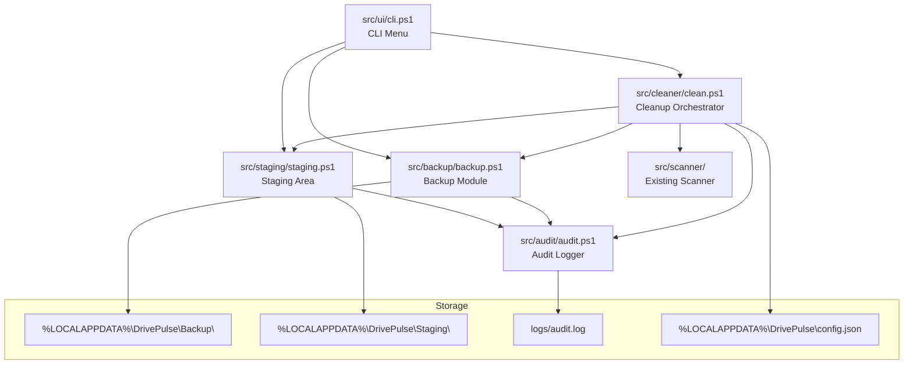
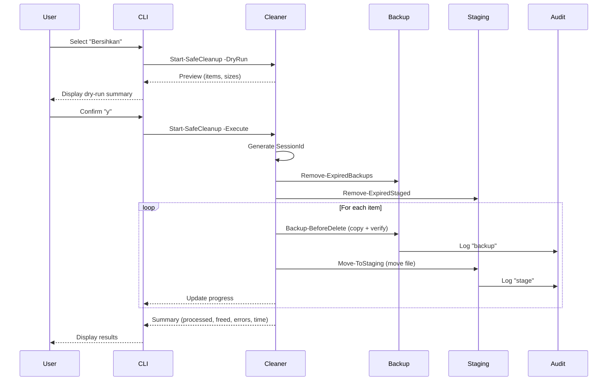

# Design Document: Safety Cleanup

## Overview

DrivePulse v1.3 transforms the application from a read-only disk analysis tool into a safe, reversible cleanup tool. This design covers the implementation of one-click cleanup, mandatory backup before delete, restore/rollback, audit logging, and a staging area as an intermediate holding zone before permanent deletion.

The core safety philosophy is: **dry-run by default → preview → confirm → backup → stage → auto-purge**. No file is permanently deleted without first being backed up and moved to a staging area with a configurable retention period.

### Key Design Decisions

1. **Staging-first deletion**: Files are never deleted directly. They are moved to a staging area, and only permanently removed after the retention period expires.
2. **Mandatory backup**: Before a file is moved to staging, a byte-for-byte backup copy is created with metadata. This provides a double safety net.
3. **Session-based operations**: Each cleanup invocation is a Cleanup Session with a unique ID, enabling batch restore and audit traceability.
4. **Append-only audit log**: Every action (delete, backup, restore, stage, auto-purge) is recorded as a single-line JSON entry for reliable parsing and forensics.
5. **PowerShell 5.1 native**: No external dependencies. Uses built-in cmdlets and .NET classes available in Windows 10/11.

## Architecture



### Module Responsibilities

| Module | File | Responsibility |
|--------|------|----------------|
| **Cleaner** | `src/cleaner/clean.ps1` | Orchestrates cleanup: dry-run preview, confirmation, progress tracking, delegates to Backup/Staging/Audit |
| **Backup** | `src/backup/backup.ps1` | Creates byte-for-byte copies, verifies integrity, manages retention, supports restore |
| **Staging** | `src/staging/staging.ps1` | Moves files to holding area, manages retention auto-purge, supports restore |
| **Audit Logger** | `src/audit/audit.ps1` | Writes single-line JSON entries, handles log rotation, ensures flush-to-disk |
| **CLI** | `src/ui/cli.ps1` | Provides interactive menu for cleanup, backup, and staging commands |
| **Config** | `src/config/config-manager.ps1` | Extended to support retention period configuration |

### Data Flow: Cleanup Operation



## Components and Interfaces

### Cleaner Module (`src/cleaner/clean.ps1`)

```powershell
function Start-SafeCleanup {
    param(
        [Parameter(Mandatory)]
        [PSCustomObject[]]$Items,          # Array of CategorizedItem objects
        [switch]$DryRun,                    # Default mode - preview only
        [switch]$Force,                     # Skip confirmation (for scripting)
        [string]$SessionId                  # Optional - auto-generated if not provided
    )
    # Returns: [PSCustomObject] CleanupResult
}

function Get-CleanupPreview {
    param(
        [Parameter(Mandatory)]
        [PSCustomObject[]]$Items           # CategorizedItem objects from scanner
    )
    # Returns: [PSCustomObject] PreviewResult with ItemCount, TotalSize, ItemList
}

function Show-CleanupProgress {
    param(
        [string]$CurrentPath,
        [int]$CurrentIndex,
        [int]$TotalItems,
        [long]$SpaceFreedSoFar
    )
}
```

### Backup Module (`src/backup/backup.ps1`)

```powershell
function Backup-BeforeDelete {
    param(
        [Parameter(Mandatory)]
        [string]$SourcePath,
        [Parameter(Mandatory)]
        [string]$SessionId
    )
    # Returns: [PSCustomObject] @{ Success; BackupPath; Error }
}

function Restore-FromBackup {
    param(
        [string]$BackupPath,               # Specific file to restore
        [string]$SessionId,                 # Restore entire session
        [switch]$All,                       # Restore all from session
        [switch]$Force                      # Overwrite existing files
    )
    # Returns: [PSCustomObject] @{ Success; RestoredCount; FailedCount; TotalSize; Errors }
}

function Get-AvailableBackups {
    param(
        [string]$SessionId                  # Optional filter by session
    )
    # Returns: [PSCustomObject[]] Array of backup metadata entries
}

function Remove-ExpiredBackups {
    param(
        [int]$RetentionDays = 7
    )
    # Returns: [PSCustomObject] @{ PurgedCount; PurgedSize; Errors }
}

function Test-BackupSpace {
    param(
        [long]$RequiredBytes
    )
    # Returns: [PSCustomObject] @{ Sufficient; AvailableBytes; RequiredBytes }
}
```

### Staging Module (`src/staging/staging.ps1`)

```powershell
function Move-ToStaging {
    param(
        [Parameter(Mandatory)]
        [string]$SourcePath,
        [Parameter(Mandatory)]
        [string]$SessionId
    )
    # Returns: [PSCustomObject] @{ Success; StagedPath; Error }
}

function Restore-FromStaging {
    param(
        [Parameter(Mandatory)]
        [string]$OriginalPath,
        [switch]$Force                      # Overwrite if exists
    )
    # Returns: [PSCustomObject] @{ Success; RestoredPath; Error }
}

function Get-StagedFiles {
    # Returns: [PSCustomObject[]] sorted by StagingTimestamp descending
}

function Remove-ExpiredStaged {
    param(
        [int]$RetentionDays = 7
    )
    # Returns: [PSCustomObject] @{ PurgedCount; PurgedSize; Errors }
}

function Remove-StagedFile {
    param(
        [Parameter(Mandatory)]
        [string]$OriginalPath
    )
    # Returns: [PSCustomObject] @{ Success; Error }
}
```

### Audit Logger Module (`src/audit/audit.ps1`)

```powershell
function Write-AuditEntry {
    param(
        [Parameter(Mandatory)]
        [ValidateSet('delete', 'backup', 'restore', 'stage', 'auto-purge', 'purge-failed')]
        [string]$Action,
        [Parameter(Mandatory)]
        [string]$FilePath
    )
    # Writes single-line JSON to audit.log, handles rotation
}

function Initialize-AuditLog {
    # Creates log directory and file if missing
}

function Get-AuditLogPath {
    # Returns: [string] absolute path to logs/audit.log
}
```

### CLI Extensions (`src/ui/cli.ps1`)

New menu options added to the main menu:

```
[5] Bersihkan    -- Cleanup file yang aman (dry-run dulu)
[6] Backup       -- Kelola backup & restore
[7] Staging      -- Lihat & kelola file staging
```

## Data Models

### CleanupSession

```json
{
    "sessionId": "20260515-143022-a1b2c3",
    "startTime": "2026-05-15T14:30:22+07:00",
    "endTime": "2026-05-15T14:31:05+07:00",
    "itemsProcessed": 15,
    "totalSpaceFreed": 2147483648,
    "errors": 0,
    "status": "completed"
}
```

Session ID format: `YYYYMMDD-HHmmss-<6 random hex chars>`

### Backup Metadata (`backup-manifest.json` per session)

```json
{
    "sessionId": "20260515-143022-a1b2c3",
    "createdAt": "2026-05-15T14:30:22+07:00",
    "files": [
        {
            "originalPath": "C:\\Users\\Heri\\AppData\\Local\\Temp\\cache.dat",
            "backupPath": "20260515-143022-a1b2c3\\Users\\Heri\\AppData\\Local\\Temp\\cache.dat",
            "sizeBytes": 1048576,
            "timestamp": "2026-05-15T14:30:23+07:00"
        }
    ]
}
```

### Staging Metadata (`staging-manifest.json`)

```json
{
    "files": [
        {
            "originalPath": "C:\\Users\\Heri\\AppData\\Local\\Temp\\cache.dat",
            "stagedPath": "C%3A\\Users\\Heri\\AppData\\Local\\Temp\\cache.dat",
            "sizeBytes": 1048576,
            "stagingTimestamp": "2026-05-15T14:30:24+07:00",
            "sessionId": "20260515-143022-a1b2c3"
        }
    ]
}
```

### Audit Log Entry (single line in `logs/audit.log`)

```json
{"timestamp":"2026-05-15T14:30:23+07:00","action":"backup","file":"C:\\Users\\Heri\\AppData\\Local\\Temp\\cache.dat","user":"Heri"}
```

### Directory Structure

```
%LOCALAPPDATA%\DrivePulse\
├── Backup\
│   ├── 20260515-143022-a1b2c3\        # Session directory
│   │   ├── backup-manifest.json        # Metadata for this session
│   │   └── C%3A\                       # Drive-encoded subdirectory
│   │       └── Users\Heri\...\file     # Preserved directory structure
│   └── 20260514-091500-d4e5f6\         # Older session
│       └── ...
├── Staging\
│   ├── staging-manifest.json           # Central manifest
│   └── C%3A\                           # Drive-encoded subdirectory
│       └── Users\Heri\...\file         # Preserved directory structure
├── config.json                         # User config (extended with retentionDays)
└── Logs\                               # Application logs (errors, warnings)

<project-root>\
└── logs\
    └── audit.log                       # Append-only audit log (JSONL)
```

### Extended User Config (`config.json`)

```json
{
    "whitelist": [],
    "blacklist": [],
    "largeFolderGB": 5,
    "backupRetentionDays": 7,
    "stagingRetentionDays": 7
}
```

Valid range for retention: 1–90 days (integer). Invalid values fall back to default 7.

## Correctness Properties

*A property is a characteristic or behavior that should hold true across all valid executions of a system—essentially, a formal statement about what the system should do. Properties serve as the bridge between human-readable specifications and machine-verifiable correctness guarantees.*

### Property 1: Dry-run filesystem invariance

*For any* set of files on disk and any user input that is not "y" or "Y" (including empty input, arbitrary strings, and the dry-run default mode), running the cleanup operation SHALL leave all files unmodified — no files are created, moved, or deleted.

**Validates: Requirements 1.3, 1.6, 2.3**

### Property 2: Preview completeness and correctness

*For any* array of CategorizedItem objects (with varying counts from 1 to 1000, varying sizes, paths, and categories), the cleanup preview SHALL report a total item count equal to the array length and a total size equal to the sum of all item SizeBytes values, and each item's path, size, and category SHALL appear in the preview output.

**Validates: Requirements 1.2, 1.4, 2.1**

### Property 3: Progress tracking correctness

*For any* list of N items being processed during cleanup, after processing item at index I (0-based), the displayed percentage SHALL equal `floor((I+1) / N * 100)`, the displayed path SHALL be the item's path truncated to 60 characters with "..." appended if longer, and the cumulative space freed SHALL equal the sum of SizeBytes for items 0 through I.

**Validates: Requirements 3.1, 3.2, 3.5**

### Property 4: Error resilience — skip and continue

*For any* list of items where a subset fails during backup, staging, or restore, the operation SHALL continue processing all remaining items, and the final result SHALL report the correct count of successes and failures.

**Validates: Requirements 3.4, 4.4, 5.5**

### Property 5: Backup byte-for-byte round-trip

*For any* file with arbitrary binary content, backing up the file and then restoring it to the original path SHALL produce a file whose size in bytes and content are identical to the original.

**Validates: Requirements 4.1, 5.1**

### Property 6: Backup structure and metadata preservation

*For any* absolute Windows file path and any valid SessionId, the backup SHALL be stored at `<BackupRoot>/<SessionId>/<drive-encoded>/<relative-path>` preserving the original directory hierarchy, and the backup manifest SHALL contain the original absolute path, an ISO 8601 timestamp, the file size in bytes, and the SessionId.

**Validates: Requirements 4.2, 4.3, 4.5**

### Property 7: Retention-based purge correctness

*For any* set of backup or staging entries with varying timestamps and any configured retention period R (where 1 ≤ R ≤ 90), running the purge operation SHALL delete exactly those entries whose timestamp is older than R days from the current time, and SHALL leave all entries within the retention window untouched. If R is outside 1–90 or non-numeric, the default of 7 days SHALL be applied.

**Validates: Requirements 4.7, 6.2, 6.4, 6.5, 8.7, 9.2, 9.4**

### Property 8: Audit log entry round-trip serialization

*For any* combination of valid action string, absolute Windows file path (including paths with backslashes, spaces, unicode characters, and JSON special characters like quotes), and Windows username, writing an audit log entry and then parsing the resulting JSON line SHALL yield the exact original values for timestamp, action, file, and user fields without data loss.

**Validates: Requirements 7.2, 13.1, 13.3, 13.5**

### Property 9: Audit log append-only invariant

*For any* sequence of N audit log writes, after the Nth write, the file SHALL contain exactly N lines (each terminated by CRLF), and the content of lines 1 through N-1 SHALL be byte-for-byte identical to their content before the Nth write.

**Validates: Requirements 7.1, 13.2**

### Property 10: Audit log rotation threshold

*For any* audit log file whose size is at or above 10 MB, writing the next entry SHALL trigger rotation (rename existing file with timestamp suffix, create new file), and the new file SHALL contain only the newly written entry.

**Validates: Requirements 7.11**

### Property 11: Staging moves files preserving structure

*For any* file at an absolute Windows path, executing cleanup SHALL result in the file being absent from its original location and present in the Staging_Root at a path that preserves the original directory structure, with metadata recording the original path, staging timestamp, and file size.

**Validates: Requirements 8.1, 8.2, 8.3**

### Property 12: Staged files list sort order

*For any* set of staged files with distinct staging timestamps, calling Get-StagedFiles SHALL return them sorted by staging timestamp in descending order (most recent first).

**Validates: Requirements 8.4**

### Property 13: Staging restore round-trip

*For any* file that has been moved to the staging area, restoring it SHALL place a file at the original path with content identical to what was staged, and the file SHALL no longer exist in the staging area.

**Validates: Requirements 8.5**

### Property 14: Safe-only cleanup filter

*For any* array of CategorizedItem objects containing a mix of "Safe" and "Check" categories, executing cleanup SHALL process only items with Category equal to "Safe", and SHALL not modify, move, or delete any item with Category "Check".

**Validates: Requirements 10.4**

## Error Handling

### Error Categories and Responses

| Error | Module | Response |
|-------|--------|----------|
| Insufficient disk space for backup | Backup | Notify user with space comparison, offer partial backup or cancel |
| Backup copy verification failure | Backup | Skip deletion of that file, log error, continue |
| File locked during staging | Staging | Skip file, notify user, continue with remaining |
| Permission denied (file access) | All | Skip item, log to audit with "purge-failed", continue |
| Audit log write failure | Audit | Write warning to console, do NOT block the operation |
| Audit log directory missing | Audit | Create directory and file automatically |
| Config file corrupt/invalid | Config | Fall back to defaults, display warning |
| Restore target already exists | Backup/Staging | Prompt user for overwrite confirmation |
| Backup already purged | Backup | Display error message, skip file |

### Error Propagation Strategy

```
Item Processing Loop:
  try {
    1. Backup file → if fails → skip item, log, continue
    2. Move to staging → if fails → skip item, log, continue  
    3. Log to audit → if fails → warn console, continue
    4. Update progress
  } catch {
    Record error, continue to next item
  }
```

### Graceful Degradation

- If audit logging fails entirely, cleanup still proceeds (audit is non-blocking)
- If backup space is insufficient, user can choose to proceed without backup (with explicit warning)
- If staging space is insufficient for a specific file, that file is skipped but others continue
- Partial failures never corrupt existing data — operations are atomic per-file

## Testing Strategy

### Property-Based Testing (Pester + Custom Generators)

This feature is well-suited for property-based testing because it involves:
- Pure data transformations (path manipulation, size calculation, JSON serialization)
- Universal invariants (round-trips, append-only, sort order)
- Input spaces that benefit from randomization (file paths, sizes, timestamps, special characters)

**Framework**: Pester 5.x with custom generators in `tests/helpers/generators.ps1`
**Minimum iterations**: 100 per property test
**Tag format**: `Feature: safety-cleanup, Property {N}: {title}`

Property tests will be placed in:
- `tests/property/cleanup.Property.Tests.ps1` — Properties 1-4, 14
- `tests/property/backup.Property.Tests.ps1` — Properties 5-7
- `tests/property/audit.Property.Tests.ps1` — Properties 8-10
- `tests/property/staging.Property.Tests.ps1` — Properties 11-13

### Unit Tests (Pester)

Unit tests cover specific examples, edge cases, and integration points:
- Empty item list behavior (Requirements 1.7, 2.5)
- Default mode is dry-run (Requirement 1.1)
- Confirmation with "y"/"Y" proceeds (Requirement 2.2)
- Bahasa Indonesia text output (Requirements 2.4, 10.6, 11.5, 12.5)
- No scan result available (Requirement 10.2)
- Backup not found for restore (Requirement 5.6)
- File conflict during restore (Requirements 5.4, 8.6, 12.6)
- UTF-8 without BOM encoding (Requirement 13.4)
- Insufficient space notification (Requirements 4.6, 8.8)
- Staging empty state (Requirement 12.4)

Unit tests will be placed in:
- `tests/unit/cleanup.Tests.ps1`
- `tests/unit/backup.Tests.ps1`
- `tests/unit/audit.Tests.ps1`
- `tests/unit/staging.Tests.ps1`

### Integration Tests

Integration tests verify end-to-end flows:
- Full cleanup cycle: scan → preview → confirm → backup → stage → verify
- Restore cycle: backup → delete original → restore → verify content
- Retention purge: create old entries → start session → verify purge
- CLI menu navigation for cleanup/backup/staging commands

Integration tests will be placed in:
- `tests/integration/cleanup-flow.Tests.ps1`
- `tests/integration/restore-flow.Tests.ps1`

### New Generators Required

The following generators will be added to `tests/helpers/generators.ps1`:

- `New-RandomAuditEntry` — random action, path (with special chars), username, timestamp
- `New-RandomSessionId` — valid session ID format
- `New-RandomFileContent` — random binary content of varying sizes
- `New-RandomRetentionDays` — valid (1-90) and invalid values
- `New-RandomTimestamp` — ISO 8601 timestamps spanning past/future relative to retention
- `New-RandomStagedFile` — staged file metadata with random fields
- `New-RandomBackupManifest` — complete backup manifest with random entries

